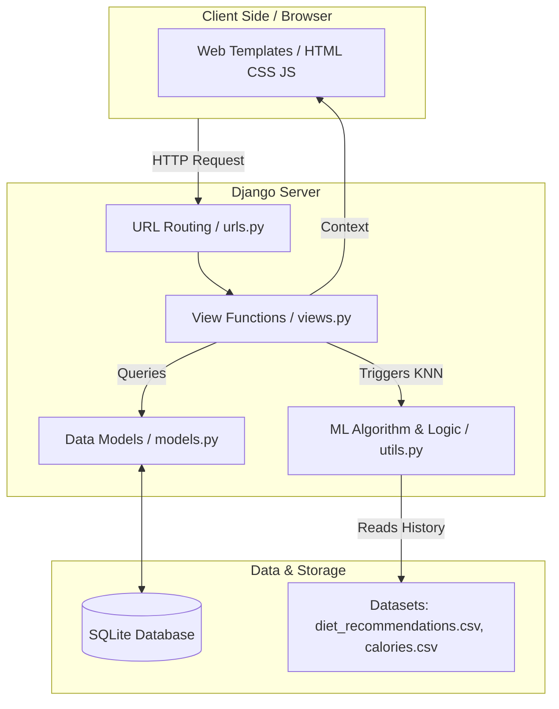
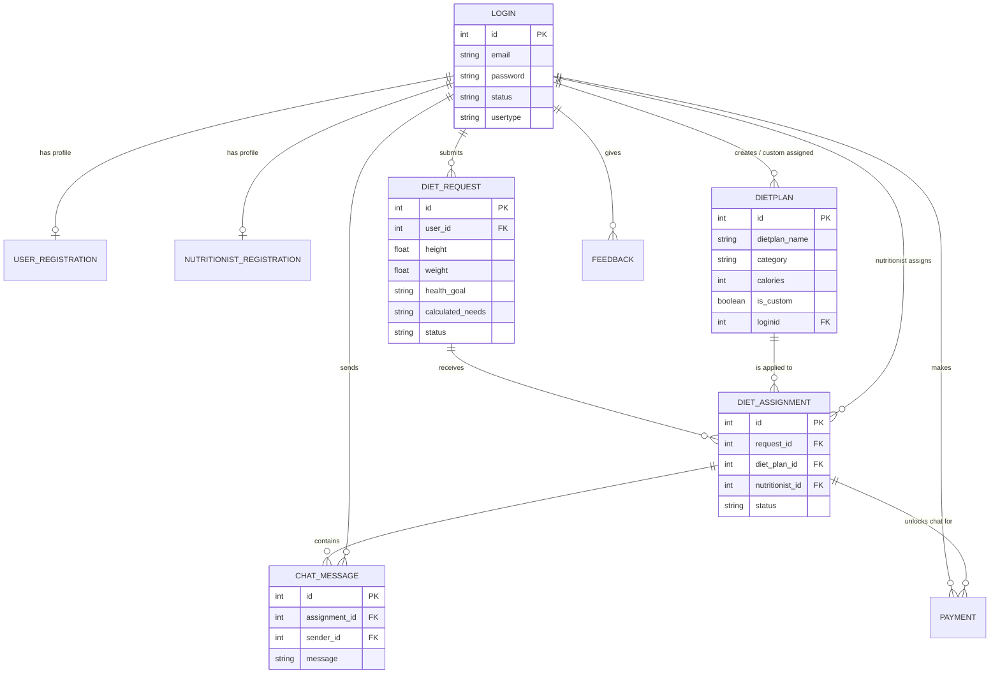
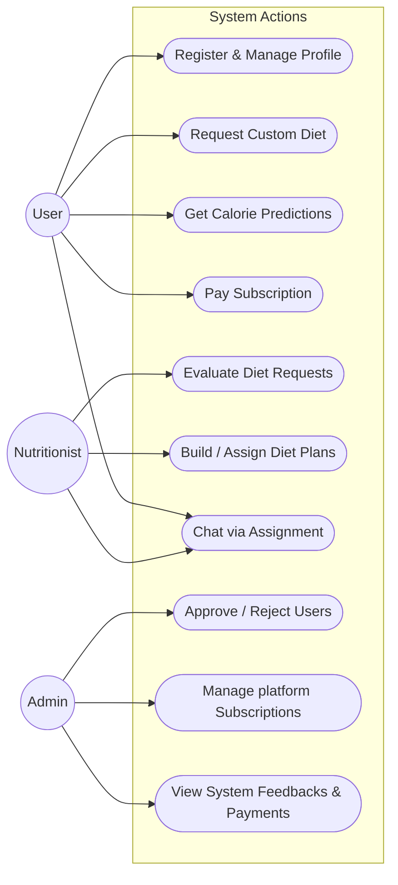

# Project Architecture and Diagrams

This document outlines the high-level architecture, entity-relationship models, system use cases, and class structures of the **Dietary Management System**.

## 1. System Architecture Diagram

This flowchart visualizes the underlying software architecture and the logical progression of data between the frontend user interface, backend Django server, internal algorithms, and the database.

---

## 2. Entity-Relationship (ER) Diagram

The ER Diagram defines the relational structure of the database tables and how the entities connect via foreign keys.

---

## 3. Use Case Diagram

The Use Case diagram visualizes the primary interactions each system actor (User, Nutritionist, Admin) has with the application's features.

---

## 4. Class Diagram

The Class Diagram demonstrates the internal structure of the Python backend models (`models.py`) and their property distributions.

```mermaid
classDiagram
    class Login {
        +EmailField email
        +CharField password
        +CharField status
        +CharField usertype
    }

    class UserRegistration {
        +CharField name
        +BigIntegerField phone
        +IntegerField age
        +FloatField height
        +FloatField weight
        +CharField health_goal
        +ForeignKey loginid
    }

    class NutritionistRegistration {
        +CharField username
        +CharField qualification
        +CharField experience
        +ForeignKey loginid
    }

    class Dietplan {
        +CharField dietplan
        +CharField category
        +TextField breakfast
        +TextField lunch
        +TextField dinner
        +PositiveIntegerField calories
        +BooleanField is_custom
        +ForeignKey loginid
    }

    class DietRequest {
        +FloatField height
        +FloatField weight
        +CharField calculated_needs
        +CharField food_preference
        +CharField status
        +ForeignKey user
        +latest_assignment() property
    }

    class DietPlanAssignment {
        +CharField status
        +TextField comments
        +DateTimeField assigned_date
        +ForeignKey request
        +ForeignKey diet_plan
        +ForeignKey nutritionist
    }

    class ChatMessage {
        +TextField message
        +DateTimeField timestamp
        +ForeignKey assignment
        +ForeignKey sender
    }

    class Payment {
        +FloatField amount
        +CharField status
        +DateTimeField timestamp
        +ForeignKey assignment
        +ForeignKey user
    }

    Login "1" -- "1" UserRegistration
    Login "1" -- "1" NutritionistRegistration
    Login "1" -- "*" DietRequest
    Login "1" -- "*" Dietplan
    DietRequest "1" -- "*" DietPlanAssignment
    Dietplan "1" -- "*" DietPlanAssignment
    DietPlanAssignment "1" -- "*" ChatMessage
    DietPlanAssignment "1" -- "*" Payment
```

