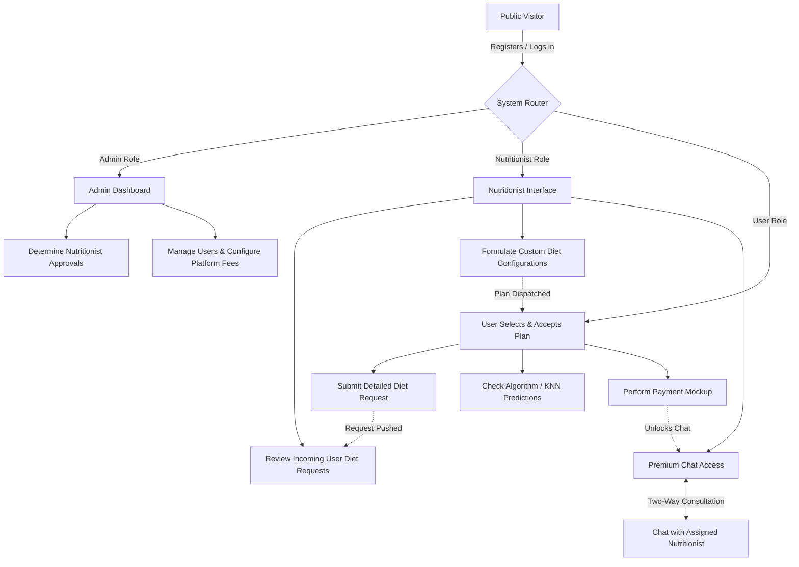

# Dietary Management System

## 1. Working of the Project
The Dietary Management System is a comprehensive Django-based web application designed to connect users with certified professional nutritionists. The application facilitates a seamless workflow where users can monitor their personal health metrics, request customized dietary advice, and receive algorithmic suggestions based on their physiological data. Nutritionists can evaluate user requests, build dynamic meal plans, and communicate directly with users to trace their ongoing fitness progress.

## 2. Website Features & Options

### User Features:
- **Registration & Profile Tracking:** Users create accounts and supply core metrics (Age, Height, Weight, Gender).
- **Diet Plan Requests:** Users submit structured requests (including allergies, existing medical conditions, and food preferences) to receive expert guidance.
- **Automated Calculations (Mifflin-St Jeor):** The platform automatically assesses the user's BMR (Basal Metabolic Rate) and TDEE (Total Daily Energy Expenditure) upon request submission.
- **AI/Algorithm Recommendations:** Get instant dietary suggestions derived from historical data sets.
- **Calorie Finder:** Users can query the calorie breakdown of specific foods with an integrated search utility.
- **Premium Chat Subscription:** Users can pay an assignment-based subscription fee to unlock a persistent 1-on-1 chat interface with their assigned nutritionist.
- **Feedback Module:** Easily submit service reviews and rate experiences.

### Nutritionist Features:
- **Profile Application:** Nutritionists can sign up but will remain in a "pending" status until cleared by the central Admin.
- **Request Evaluation:** View all user-submitted diet plan requests. 
- **Plan Generation:** Develop brand-new custom diets or selectively allocate robust, pre-formulated modular plans.
- **Interactive Review:** Receive notifications for user revisions and converse with subscribed users through the web portal.

### Admin Features:
- **System Dashboard:** Unified perspective across the whole business structure.
- **User & Staff Management:** Ability to approve, reject, or delete newly registered Nutritionists and standard Users.
- **Payment Log:** Monitor aggregate revenue generated via user subscriptions.
- **Subscription Configuration:** Modify global subscription prices.

---

## 3. Algorithm & Model Information

Rather than using a generic black-box pre-trained network, this application employs a tailored **K-Nearest Neighbors (KNN)** inspired geometric distance approach utilizing a structured Pandas dataset (`diet_recommendations_dataset.csv`).

**How the Algorithm is Trained and Functions:**
1. **Data Ingestion:** The `app/data/` environment holds structured records defining historical diet correlations depending upon age, BMI, physical activity, diseases, allergies, and cuisine types.
2. **Data Encoding & Imputation:** Missing fields are replaced dynamically. Categorical fields (Gender, Activity, Disease mapping) are encoded ordinally mapping directly to integer values.
3. **Min-Max Normalization:** To prevent variables with large scales (like Age or Exercise Hours) from outweighing smaller categorical flags, all dataset features scale down to a common `[0, 1]` threshold.
4. **Vector Distance:** When a user queries a recommendation, their input is formed into an identical normalized vector. The algorithm calculates the **Euclidean Distance** between the new user vector against every row inside the historical dataset.
5. **Voting and Output:** The system filters for the top 10 most similar geometric profiles and applies a frequency counter. The most universally occurring diet among those profiles is designated as the recommended plan.
6. **Augmented Reasoning:** Based on the final selected diet and the user's ultimate goal (e.g., Muscle Gain vs Weight Loss), the model dynamically appends personalized reasoning logic.

---

## 4. Logical Workflow (Mermaid Flowchart)



---

## 5. How to Run This Project

To boot up the local development server and run the project, follow these exact steps within your terminal:

1. Go to the Gym folder:
   ```bash
   cd c:\gym
   ```
2. Navigate into the Project folder:
   ```bash
   cd project
   ```
3. Start the application by typing:
   ```bash
   python ./manage.py runserver
   ```
4. The server will boot locally. Open your browser to `http://127.0.0.1:8000/`.
