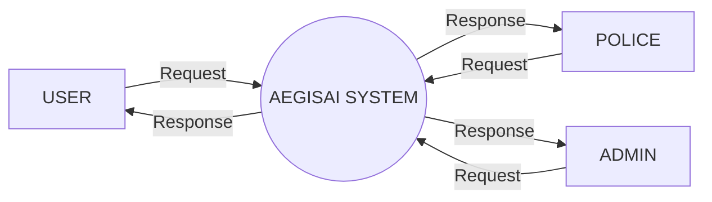
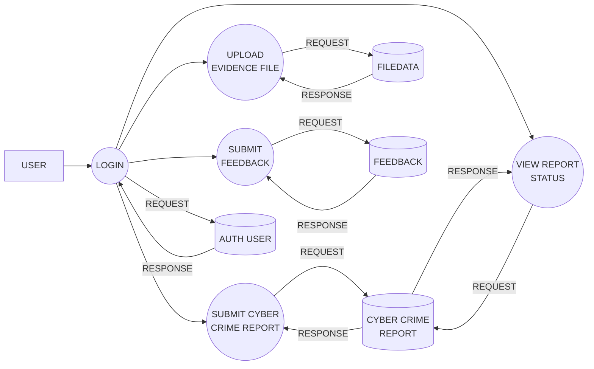
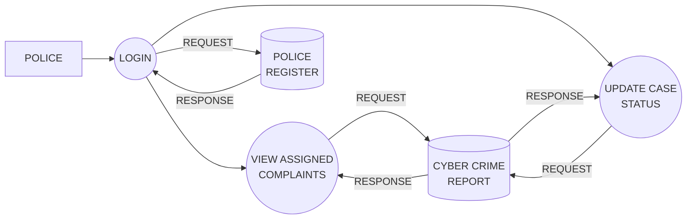
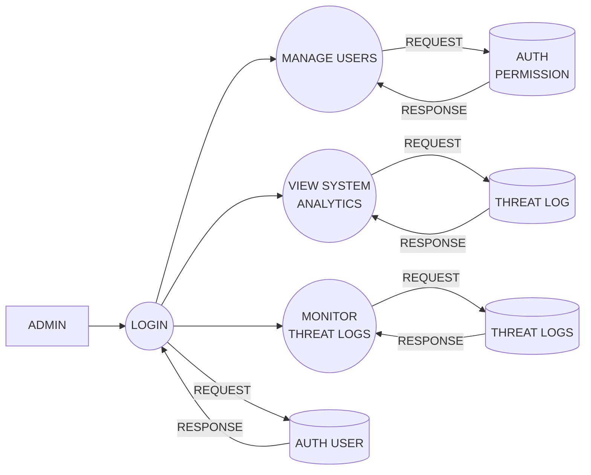

# Data Flow Diagrams (DFD)

This document contains the Data Flow Diagrams (DFD) for the AegisAI System at different levels. You can view these diagrams by natively reading this file on GitHub, or by pasting the Mermaid code blocks below into any Mermaid-compatible viewer (such as [Mermaid Live Editor](https://mermaid.live/) or Notion).

## Level 0 DFD (Context Diagram)

## Level 1 DFD - USER

## Level 1 DFD - POLICE

## Level 1 DFD - ADMIN

